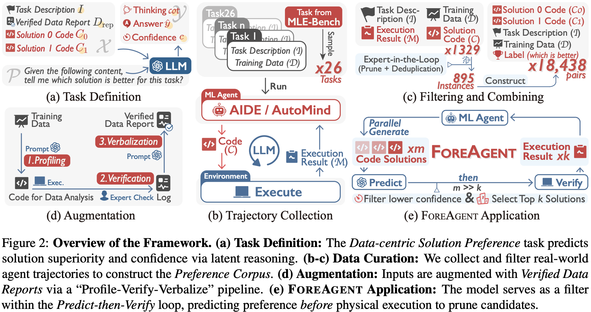
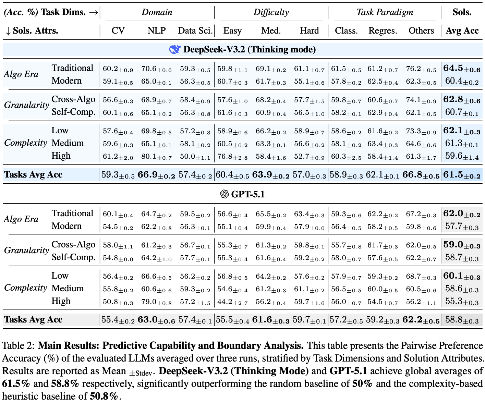

<div align="center">
<h2 align="center">Can We Predict Before Executing Machine Learning Agents?</p>

<h4 align="center">
  <a href="https://arxiv.org/abs/2601.05930" target="_blank">📄Paper</a> •
  <a href="https://huggingface.co/papers/2601.05930" target="_blank">🤗HFPaper</a> •
  <a href="https://drive.google.com/drive/folders/1rn3GuRcl-BrnPG2xUJYCOJB-BwGp7bp0?usp=sharing" target="_blank">📦Data & Runtime</a> •
  <a href="https://x.com/zxlzr/status/2010603724931285141" target="_blank">𝕏Blog</a> •
  <a href="http://xhslink.com/o/8Ac0jDoHeyw" target="_blank">📕小红书</a>
</h4>


 

[](https://opensource.org/licenses/MIT)

---

</div>


This repository contains the official implementation and data for the paper **"Can We Predict Before Executing Machine Learning Agents?"**.

Traditional machine learning agents rely on an iterative "Generate-Execute-Feedback" loop, suffering from a severe **Execution Bottleneck**. Addressing this, we ask: *Can we compress hours of physical execution into seconds of logical inference?*

To answer this, we introduce **Data-centric Solution Preference**—predicting solution performance without physical execution by leveraging "Implicit Execution Priors". We operationalize this in **FOREAGENT**, an agent employing a **Predict-then-Verify** loop to decouple exploration from execution.

Our work demonstrates that LLMs exhibit significant predictive capabilities. **FOREAGENT** achieves a **6× acceleration**, expands the search space by **3.2×**, and yields a **+6% performance gain** over baselines. We also release a foundational dataset of verified execution trajectories.

## 📰 News

- **[2026-02-08]** We have released all [code](.) and [data](https://drive.google.com/drive/folders/1rn3GuRcl-BrnPG2xUJYCOJB-BwGp7bp0?usp=sharing).
- **[2026-01-09]** We release our paper [Can We Predict Before Executing Machine Learning Agents?](https://arxiv.org/abs/2601.05930).

## 📖 Contents

- [🔍 Overview](#-overview)
- [🚀 Results](#-results)
- [📦 Data & Runtime](#-data--runtime)
- [🛠️ Environment Setup](#-environment-setup)
- [🙏 Acknowledgement](#-acknowledgement)
- [👥 Contributors](#-contributors)
- [📝 Citation](#-citation)

## 🔍 Overview

To answer the titular question, we structured our research into three key phases, corresponding to the modules in this repository:

1.  **Corpus Construction** (`prepare_bench_subset/`) 🏗️
    *   We defined the **Data-centric Solution Preference** task and constructed a large-scale corpus of **18,438** pairwise comparisons derived from real-world execution trajectories (AIDE & AutoMind) on MLE-bench.
    *   This module handles solution sampling, cleaning, execution, and ground-truth generation.
    *   👉 [prepare_bench_subset/README.md](prepare_bench_subset/README.md)

2.  **Predictive Evaluation** (`grade/`) 📊
    *   We extensively evaluated LLMs (e.g., DeepSeek-V3.2, GPT-5.1) on this corpus to determine if they possess "Implicit Execution Priors".
    *   We found that reasoning-optimized models significantly outperform random guessing and complexity heuristics.
    *   👉 [grade/README.md](grade/README.md)

3.  **FOREAGENT Application** (`mle-bench/`) 🤖
    *   Leveraging these findings, we developed **FOREAGENT**, an autonomous agent that integrates the "Predict-then-Verify" loop.
    *   By using the LLM as an implicit world model to prune the search space, it decouples exploration from expensive physical execution.
    *   👉 [mle-bench/README.md](mle-bench/README.md)

<div align="center">
  
</div>

## 🚀 Results

### 1. Feasibility of Run-Free Preference
Our experiments on the curated corpus demonstrate that LLMs exhibit significant predictive capabilities, transcending simple heuristics.

<div align="center">

| Model | Accuracy | vs. Random (50%) | vs. Heuristic (50.8%) |
| :---: | :---: | :---: | :---: |
| **DeepSeek-V3.2-Thinking** | **61.5%** | ✅ Significant | ✅ Significant |
| GPT-5.1 | 58.8% | ✅ Significant | ✅ Significant |

</div>

Stratified pairwise accuracy results proving LLMs derive valid signals from static inputs through genuine reasoning.

<div align="center">
  
</div>

### 2. FOREAGENT Performance
Integrating this predictive mechanism into the **FOREAGENT** application yields substantial efficiency and performance gains:

- ⚡ **6× Speedup**: Converges to peak performance using only 1/6 of the execution time compared to baselines.
- 🔍 **3.2× Broader Search**: Explores significantly more solution candidates within the same time budget.
- 📈 **+6% Beat Ratio**: achieves a higher win rate against human leaderboard contestants across diverse AI4Science tasks (e.g., Biology, Physics, Geoscience).

<div align="center">
  
</div>

## 📦 Data & Runtime

We provide the curated solution corpora, analysis subsets, agent-run trajectories, and task resources used in our experiments.

📥 **[Download Data (Google Drive)](https://drive.google.com/drive/folders/1rn3GuRcl-BrnPG2xUJYCOJB-BwGp7bp0?usp=sharing)**

The data package includes (but is not limited to):
- **`solutions_all/`**: The full unfiltered solution corpus.
- **`solutions_subset_50/`**: The main experiment subset (capped at 50 solutions per task).
- **`agent_runs/`**: Full trajectories and logs from AIDE and ForeAgent runs.
- **`tasks/`**: Shared data hub containing competition data, descriptions, and analysis reports.

For a comprehensive description, please refer to the `data/README.md` file included in the downloaded package.

## 🛠️ Environment Setup

### 1. Corpus Construction & Prediction Benchmark

To build the corpus or run the prediction benchmark, please set up the environment as follows:

```bash
conda create -n pbe python=3.10
conda activate pbe
pip install -r requirement.txt

# Set environment variables
export OPENAI_API_KEY="<your_openai_api_key>"
export OPENAI_BASE_URL="<your_openai_base_url>"
export OPENAI_MODEL="DeepSeek-V3.2"
```

- **Corpus Construction**: Navigate to [`prepare_bench_subset`](prepare_bench_subset/README.md).
- **Prediction Benchmark**: Navigate to [`grade`](grade/README.md).

### 2. ForeAgent (Agent Execution)

Our agent implementation is based on MLE-bench. Please refer to [`mle-bench/README.md`](mle-bench/README.md) for detailed installation and execution instructions.

## 🙏 Acknowledgement

This project builds upon and expresses gratitude to the following open-source projects:
- [AutoMind: Adaptive Knowledgeable Agent for Automated Data Science](https://github.com/zjunlp/AutoMind)
- [AIDE: AI-Driven Exploration in the Space of Code](https://github.com/WecoAI/aideml)
- [MLE-Bench: Evaluating Machine Learning Agents on Machine Learning Engineering](https://github.com/openai/mle-bench)

## 👥 Contributors

<a href="https://github.com/zjunlp/predict-before-execute/graphs/contributors">
  </a>

We will offer long-term maintenance to fix bugs for the project. Issues and PRs are welcome!

## 📝 Citation

If you find this work useful in your research, please cite our paper:

```bibtex
@misc{zheng2026predictexecutingmachinelearning,
      title={Can We Predict Before Executing Machine Learning Agents?}, 
      author={Jingsheng Zheng and Jintian Zhang and Yujie Luo and Yuren Mao and Yunjun Gao and Lun Du and Huajun Chen and Ningyu Zhang},
      year={2026},
      eprint={2601.05930},
      archivePrefix={arXiv},
      primaryClass={cs.CL},
      url={https://arxiv.org/abs/2601.05930}, 
}
```
