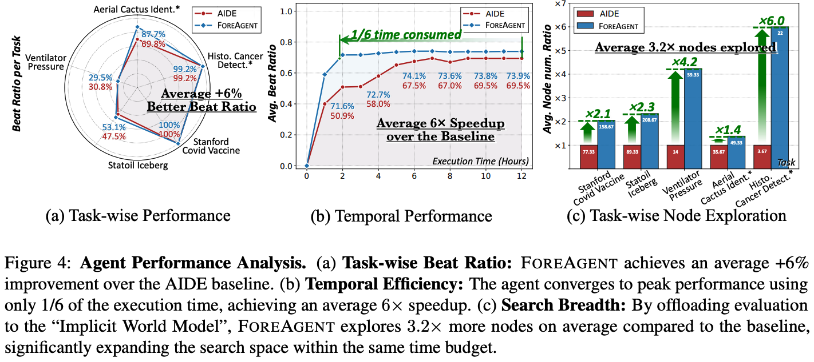

# 🤖 ForeAgent (MLE-bench Integration)

**FOREAGENT** is our autonomous machine learning agent, evolved from [AIDE](https://github.com/WecoAI/aideml) and integrated with [MLE-bench](https://github.com/openai/mle-bench/tree/main) for standardized launching and evaluation. It implements a novel **Predict-then-Verify** loop to drastically reduce execution costs.

---

## 🧠 Design Philosophy

FOREAGENT re-engineers the improvement stage into a **Predict-then-Verify loop** to bridge the implementation gap. The workflow consists of three distinct phases:

1.  **🚀 High-Volume Generation**: Proposing $m=10$ solution candidates in parallel to maximize search breadth without immediate execution costs.
2.  **⚖️ Confidence-Gated Pairwise Selection**: Employing a confidence gate ($c=0.7$) to filter candidates, ensuring only high-certainty solutions proceed.
3.  **✅ Verification Execution**: Physically verifying only the top-$k$ ($k=1$) candidate to anchor the trajectory with real execution feedback.

👉 *For more theoretical details, please refer to the [ForeAgent Detailed Design](agents/aide/README.md).*

---

## 📊 Experimental Setup & Results

### 🧪 Tasks

We evaluate FOREAGENT on five diverse AI4Science tasks from MLE-bench:

<div align="center">

| Competition ID | Domain | Dataset Size |
| :---: | :---: | :---: |
| `stanford-covid-vaccine` | 🧬 Biology | 14MB |
| `ventilator-pressure-prediction` | 🔭 Physics | 291MB |
| `statoil-iceberg-classifier-challenge` | 🌍 Geoscience | 205MB |
| `aerial-cactus-identification` | 🌿 Ecology | 25.4MB |
| `histopathologic-cancer-detection` | ⚕️ Medicine | 7.7GB |

</div>

### ⚙️ Setup

- **Benchmark**: MLE-bench (12-hour limit).
- **Baselines**: AIDE.
- **Models**:
    - **Coding**: DeepSeek-V3.2.
    - **Implicit World Modeling**: DeepSeek-V3.2-Thinking.
- **Reliability**: 3 independent runs per task; reporting average Beat Ratio.

### 📈 key Results

By substituting costly execution with rapid inference, **FOREAGENT** achieves:
- ⚡ **6× Speedup** in average execution time.
- 🔍 **3.2× More Nodes** explored within 1/6th of the time budget.
- 🏆 **+6% Beat Ratio** improvement over baselines.

<div align="center">
  
</div>

---

## 💻 Installation & Usage

### 1. Environment Setup

We run FOREAGENT on top of MLE-bench. Please create a dedicated environment and install the package:

```console
# Create a fresh environment (recommended)
conda create -n mlebench python=3.10
conda activate mlebench

# Install in editable mode
pip install -e .
```

### 2. Launching Runs

Use the provided script to build the docker image and launch agent runs. The `run_agent.py` script accepts the following key arguments:

- `--agent-id`: Select the agent image name.
- `--competition-set`: Path to a text file containing competition IDs.
- `--data-dir`: Path to the prepared Kaggle data directory.
- `--gpu-device`: GPU device IDs to use.

**Example Command:**

```bash
# See scripts/run.sh for the complete template
bash scripts/run.sh
```

> ⚠️ **Note:** Please verify and adjust paths (e.g., `--data-dir`) in `scripts/run.sh` to match your local environment before running.

### 3. Evaluation

Submissions must be `.csv` files following the competition's format.

**Batch Grading:**
Provide a JSONL file where each line contains:
- `competition_id`: The competition ID.
- `submission_path`: Path to the submission CSV.

```bash
mlebench grade --submission-file results.jsonl
```

**Single Sample Grading:**

```bash
mlebench grade-sample \
    --competition-id stanford-covid-vaccine \
    --submission-file submission.csv
```

---

