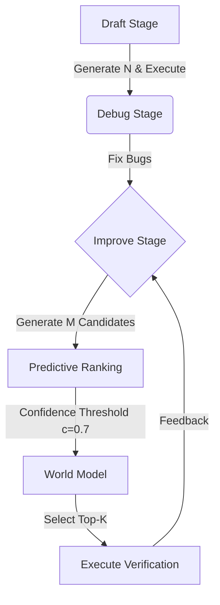

# 🤖 ForeAgent Design Document

## 1. 📖 Overview

Building on the predictive capabilities of the **World Model**, we propose **ForeAgent**, a hybrid autonomous ML agent designed to decouple hypothesis exploration from physical execution. This document specifies how the World Model is integrated into AIDE to enable predictive pruning and a conservative **Predict-then-Verify** workflow, compressing expensive runtime feedback into fast logical inference while preserving reliability through targeted execution.

---

## 2. 💡 Core Motivation

### 🛑 Problem
Current ML agents (e.g., AIDE) are bottlenecked by execution: each hypothesis requires training and evaluation to obtain feedback, making search slow and costly. This execution bottleneck limits exploration and widens the validation-test gap when agents cannot afford to verify enough alternatives.

### ✅ Solution
Introduce a **World Model** that can:
1.  🔮 **Predict** the relative performance of multiple candidates without execution.
2.  📊 **Rank** candidates using confidence-gated pairwise comparisons.
3.  ⚓ **Verify** only the most promising candidates to anchor the trajectory in real execution.

---

## 3. 🏗️ High-Level Architecture

The ForeAgent workflow modifies the standard AIDE pipeline specifically at the **Improve Stage**:



1.  **Draft Stage (unchanged)**: Generate and execute N initial solutions to establish a baseline.
2.  **Debug Stage (unchanged)**: Fix bugs through real execution (implementation gap).
3.  **Improve Stage (World Model Enabled)**:
    *   Generate **M** candidate improvements (e.g., M = 10).
    *   Perform **Confidence-gated pairwise ranking** (threshold c = 0.7).
    *   Select **Top-K** candidates (e.g., K = 1).
    *   Execute all Top-K candidates.
    *   With probability **P** (e.g., P = 0.2), exit World Model mode.

---

## 4. 📐 Key Design Principles

### 4.1 Draft Stage: Unchanged
*   **Rationale**: Initial diversity is critical for exploration.
*   Draft solutions are always fully executed to establish a baseline.

### 4.2 Debug Stage: Unchanged
*   **Rationale**: Bugs must be fixed through real execution (implementation gap).
*   LLM-designed solutions often fail due to complexity, timeout, or edge cases.
*   Only real execution can reveal and correct these issues.

### 4.3 Improve Stage: World Model Enabled
*   **Rationale**: The Improve stage operates on already-valid solutions, making it the safest place to apply predictive pruning without risking implementation failure.
*   Improvements are incremental changes to working code, so ranking by expected gain is meaningful.
*   The World Model evaluates candidates using task context, verified data narratives, and code logic to estimate relative performance.

---

## 5. 🧠 World Model Components

### 5.1 Input Representation
The World Model receives three types of input:

1.  **📋 Task Description**: ML task objectives, evaluation metrics, domain context.
2.  **📝 Verified Data Analysis Report**: A grounded semantic narrative that converts raw statistics into modeling implications via a strict code-execution-verbalization pipeline.
3.  **💻 Code Snippets**: Two candidate solutions for pairwise comparison.

### 5.2 🏆 Tournament Ranking Algorithm

Instead of $O(n^2)$ pairwise comparisons, we use tournament-style elimination:

1.  **Round 1**: Pair up all candidates and predict winners.
2.  **Confidence Check**: If confidence < threshold → both advance (inconclusive).
3.  **Winners Advance**: High-confidence winners move to next round.
4.  **Losers Tracked**: Record elimination round for each loser.
5.  **Repeat**: Continue until no more valid comparisons can be made.
6.  **Final Ranking**: `[valid winners by wins count] + [inconclusive by round]`.

**Example** (5 candidates, threshold=0.7):
```text
Round 1:
  - A vs B (conf=0.8) → A wins, B eliminated (round 1)
  - C vs D (conf=0.6) → inconclusive, both advance
  - E gets bye → advances

Round 2:
  - A vs C (conf=0.9) → A wins, C eliminated (round 2)
  - D vs E (conf=0.5) → inconclusive, both advance

Round 3:
  - A vs D (conf=0.7) → A wins, D eliminated (round 3)
  - E vs A (conf=0.4) → inconclusive

Final Ranking: [A (3 wins), E (0 wins), D (round 3), C (round 2), B (round 1)]
```

---

## 6. ⚙️ Configuration

### 6.1 YAML Configuration (`config.yaml`)
```yaml
ForeAgent/Deepseek-V3.2:
  kwargs:
    # Core agent settings
    agent.code.model: DeepSeek-V3.2
    agent.feedback.model: gpt-4o-mini-2024-07-18  # Changed: use a model that supports function calling
    agent.steps: 5000

    # World Model configuration
    agent.use_world_model: True
    agent.world_model_model: DeepSeek-V3.2-Thinking
    agent.world_model_temp: 1.0
    agent.world_model_confidence_threshold: 0.7
    agent.world_model_exec_probability: 0.2
    agent.improve_num_candidates: 10
    agent.improve_top_k: 1
    agent.search.num_drafts: 3
```

### 6.2 Key Parameters Explained
The following parameters control World Model behavior:
*   `agent.use_world_model`: Enable Predict-then-Verify in the Improve stage.
*   `agent.world_model_model`: The model used for implicit world modeling and pairwise ranking.
*   `agent.world_model_temp`: Sampling temperature for the world model.
*   `agent.world_model_confidence_threshold`: Minimum confidence $c$ to accept a comparison result; otherwise, both candidates advance.
*   `agent.world_model_exec_probability`: Probability $P$ to exit World Model mode after executing Top-$k$.
*   `agent.improve_num_candidates`: Number of improvement candidates $m$ generated per Improve step.
*   `agent.improve_top_k`: Number of candidates $k$ executed for verification.
